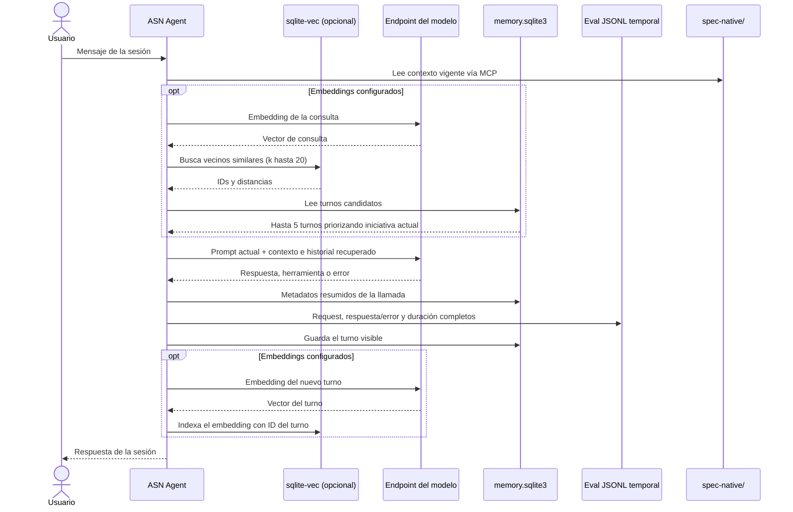
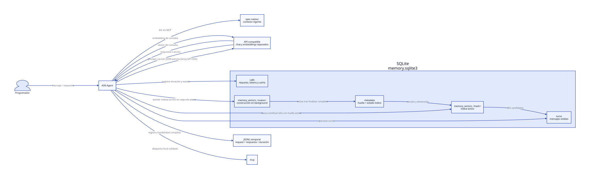
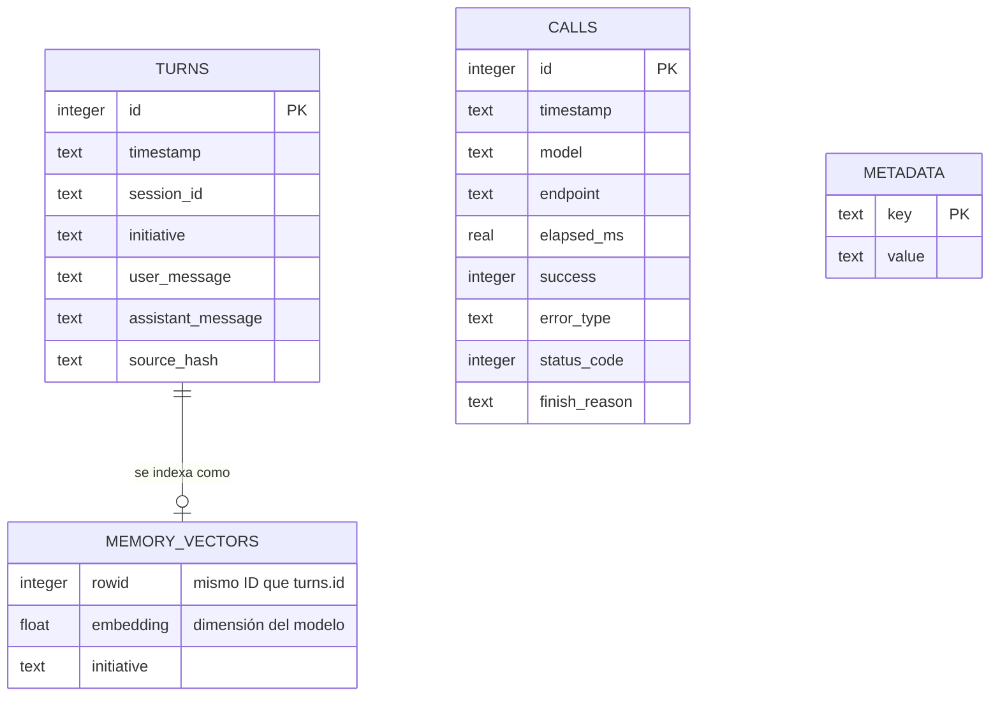

# Memoria e historial en SQLite

ASN utiliza una base SQLite local por repositorio para conservar el historial
visible de la conversación y metadatos resumidos de las llamadas al modelo.
Cuando se configura un modelo de embeddings compatible, `sqlite-vec` añade una
búsqueda semántica de turnos anteriores. Esta memoria ayuda a continuar el
trabajo; no reemplaza `spec-native/`, que sigue siendo la fuente de verdad del
proyecto.

## Dónde se guardan los datos

La ruta predeterminada es:

```text
.specnative/agent/memory.sqlite3
```

ASN crea el directorio con permisos `0700` y la base con permisos `0600` cuando
el sistema lo permite. La base está excluida de Git, por lo que cada checkout
mantiene su propio historial local.

| Tabla | Datos | Uso |
| --- | --- | --- |
| `turns` | Fecha, sesión, iniciativa y texto visible del usuario y del agente | Listar, exportar y recuperar conversaciones |
| `calls` | Fecha, modelo, endpoint sanitizado, duración, éxito, tipo de error, HTTP y `finish_reason` | Trazabilidad resumida de llamadas al modelo |
| `metadata` | Marcadores de migración y modelo/dimensión vectorial | Control de importación e índice |
| `memory_vectors` | Tabla virtual `vec0` con embeddings e iniciativa | Búsqueda por similitud mediante `sqlite-vec`, sólo si se habilita |

SQLite **no** almacena el cuerpo completo de cada petición o respuesta del
proveedor. El eval de la sesión sí registra request, respuesta o error y tiempo
de llamada en JSONL dentro de un directorio privado temporal. Ese eval puede
contener prompts, contexto del repositorio o información personal: evita
incluir credenciales en los mensajes y elimina el archivo si ya no lo necesitas.
El sistema operativo puede borrar los archivos temporales.

Los turnos sí contienen el texto que se mostró en la conversación. Por ello,
no envíes contraseñas, tokens ni otros secretos como parte de una conversación
si no quieres que queden en el historial local.

## Ciclo de una conversación



Los resultados recuperados son referencias de conversaciones previas. ASN los
añade al contexto para orientar la continuidad, mientras las instrucciones
actuales y los documentos SpecNative conservan su autoridad.

## Cómo funciona `sqlite-vec`

La dependencia Python `sqlite-vec` carga su extensión en cada conexión SQLite.
Al activarse embeddings, ASN crea `memory_vectors` como tabla virtual `vec0`,
con una columna de vectores `float[N]` y la iniciativa como metadato. El ID de
fila corresponde al ID del turno almacenado en `turns`.

Para recuperar memoria, ASN obtiene un embedding de la consulta, busca vecinos
por distancia y luego carga sus textos desde `turns`. Considera hasta veinte
candidatos y devuelve como máximo cinco; primero favorece los de la iniciativa
activa y después ordena por distancia. Al cambiar modelo o dimensión, recrea la
tabla vectorial y vuelve a indexar los turnos existentes.

Los embeddings son opcionales. ASN usa el modelo y las credenciales de la API
configurada para chat; por tanto, ese mismo endpoint debe ofrecer embeddings y
el modelo debe estar disponible allí. Si la extensión o el endpoint no sirven,
ASN muestra un aviso y conserva el historial SQL, sin búsqueda semántica.

### Configuración

En `.specnative/agent.toml`:

```toml
[agent]
history = true
embedding_model = "text-embedding-3-small"
```

O mediante variables de entorno:

```bash
export SPECNATIVE_AGENT_EMBEDDING_MODEL="nombre-del-modelo-de-embeddings"
# Sólo si deseas desactivar historial y memoria local:
export SPECNATIVE_AGENT_HISTORY=false
```

El nombre de ejemplo `text-embedding-3-small` sólo funcionará cuando el
endpoint configurado lo ofrezca. En la instalación documentada de esta máquina,
ASN usa `openai/gpt-oss-120b` en la API de Groq y no tiene `embedding_model`
configurado. El historial SQLite está activo; `sqlite-vec` está instalado, pero
no hay búsqueda vectorial hasta elegir un endpoint/modelo de embeddings
compatible. La persistencia no requiere embeddings.

## Comandos de historial

```bash
# Resumen de llamadas y turnos guardados
asn history list --repo .

# Exportar los registros del historial a JSONL; crea el archivo con permisos privados
asn history export --repo . --output /tmp/asn-history.jsonl

# El borrado interactivo pide confirmación
asn history clear --repo .

# Confirmar el borrado sin interacción
asn history clear --repo . --yes
```

`clear` limpia los registros de la base y el índice vectorial, además del JSONL
de sesión heredado si existe. El eval privado de la sesión vive por separado en
el directorio temporal; elimínalo por su ruta si necesitas borrarlo antes de
que el sistema limpie temporales.

## Importación del historial anterior

En la inicialización, ASN busca el registro de turnos anterior en
`.specnative/agent/sessions/latest.jsonl`. Si existe, importa los pares de
mensajes visibles a `turns` y registra en `metadata` que la migración ya se
ejecutó, para no repetirla en cada inicio. Los archivos eval de diagnóstico no
son esa fuente de migración.

## Vista de componentes en D2

El siguiente diagrama se genera desde el archivo fuente D2 versionado. El SVG
se incluye en el sitio para que la compilación de MkDocs no dependa de tener D2
instalado:



Fuente: [`diagrams/sqlite-history.d2`](diagrams/sqlite-history.d2). Para
regenerar el dibujo con D2 instalado:

```bash
d2 docs/diagrams/sqlite-history.d2 docs/diagrams/sqlite-history.svg
```

## Esquema de datos



`CALLS` y `TURNS` se relacionan temporalmente dentro de la misma base, pero no
tienen una clave foránea entre sí: una ejecución puede producir varias
peticiones al modelo. `MEMORY_VECTORS` es una tabla virtual opcional; `metadata`
guarda el modelo de embeddings y la dimensión del índice.
