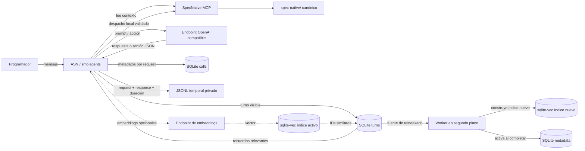
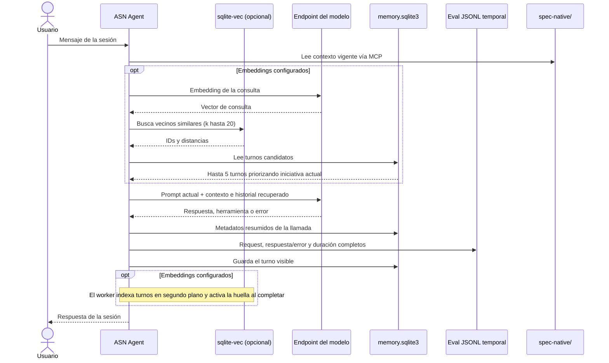
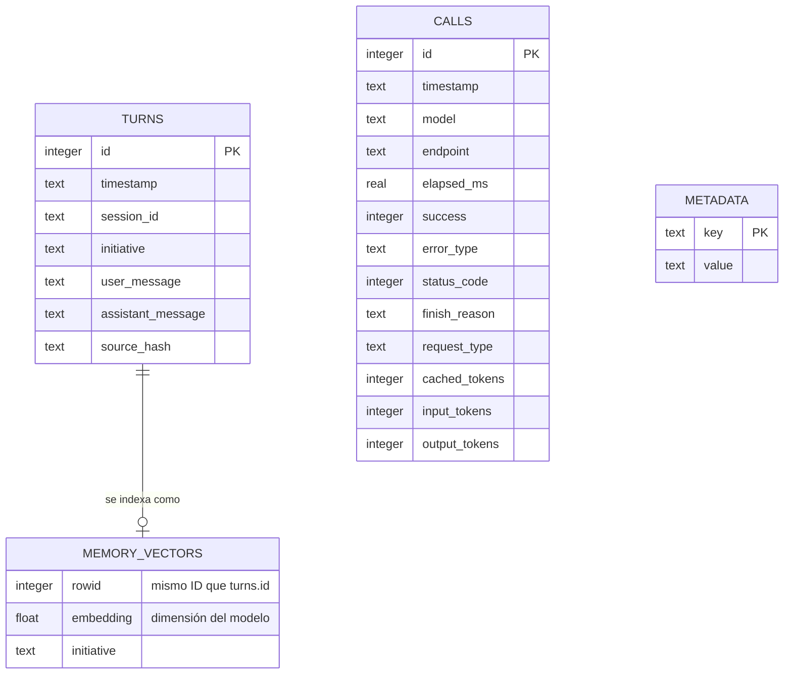

# Memoria e historial en SQLite

ASN utiliza una base SQLite local por repositorio para conservar el historial
visible de la conversación y metadatos resumidos de las llamadas al modelo.
Cuando se configura un modelo de embeddings compatible, `sqlite-vec` añade una
búsqueda semántica de turnos anteriores. Esta memoria ayuda a continuar el
trabajo; no reemplaza `spec-native/`, que sigue siendo la fuente de verdad del
proyecto.

## Dónde se guardan los datos

La ruta predeterminada es:

```text
.specnative/agent/memory.sqlite3
```

ASN crea el directorio con permisos `0700` y la base con permisos `0600` cuando
el sistema lo permite. La base está excluida de Git, por lo que cada checkout
mantiene su propio historial local.

| Tabla | Datos | Uso |
| --- | --- | --- |
| `turns` | Fecha, sesión, iniciativa y texto visible del usuario y del agente | Listar, exportar y recuperar conversaciones |
| `calls` | Fecha, modelo, endpoint sanitizado, duración, éxito, tipo de error, HTTP, tipo de petición, tokens y `finish_reason` | Trazabilidad resumida de llamadas al modelo y embeddings |
| `metadata` | Marcadores de migración, huellas probadas y estados del índice | Control de importación, reindexado y activación atómica |
| `memory_vectors_<huella>` | Tabla virtual `vec0` con embeddings e iniciativa | Índice aislado por perfil de embeddings |

SQLite **no** almacena el cuerpo completo de cada petición o respuesta del
proveedor. El eval de la sesión sí registra request, respuesta o error y tiempo
de llamada en JSONL dentro de un directorio privado temporal. Ese eval puede
contener prompts, contexto del repositorio o información personal: evita
incluir credenciales en los mensajes y elimina el archivo si ya no lo necesitas.
El sistema operativo puede borrar los archivos temporales.

Los turnos sí contienen el texto que se mostró en la conversación. Por ello,
no envíes contraseñas, tokens ni otros secretos como parte de una conversación
si no quieres que queden en el historial local.

## Ciclo de una conversación

El proceso tiene dos trazas con propósitos distintos: SQLite guarda un resumen
operativo persistente y el eval temporal conserva el intercambio completo con el
proveedor para depurar. Los turnos visibles se persisten al completar una
respuesta; las llamadas se registran una por cada request, incluidos los
reintentos y errores.



Este diagrama resume la persistencia; la secuencia temporal completa se muestra
abajo. La variante de componentes también tiene fuente D2 para regenerar el SVG
incluido.



Los resultados recuperados son referencias de conversaciones previas. ASN los
añade al contexto para orientar la continuidad, mientras las instrucciones
actuales y los documentos SpecNative conservan su autoridad.

### Qué se guarda por llamada

El envoltorio de transporte registra una fila en `calls` por cada petición al
endpoint de chat; el cliente de embeddings registra `request_type=embedding`.
Los reintentos aparecen como llamadas distintas. Además de duración, resultado,
estado HTTP y `finish_reason`, se guardan tokens de entrada/salida y los tokens
cacheados que el proveedor informe. El endpoint se sanitiza. Esta tabla **no**
guarda el prompt ni el cuerpo completo de la respuesta.

La traza JSONL temporal sí conserva request y response completos, además del
tiempo transcurrido, para evaluar fallos del modelo. Se crea con permisos
privados bajo `/tmp/asn-eval-*`; puede incluir el prompt, el contexto del
repositorio y datos escritos en la conversación. Separa esa traza de los datos
que necesitas conservar y bórrala cuando termines de diagnosticar.

El historial queda habilitado por defecto. Para desactivarlo en una ejecución:

```bash
SPECNATIVE_AGENT_HISTORY=false asn --repo .
```

O configura `history = false` en `[agent]` dentro de
`.specnative/agent.toml`. La desactivación evita crear el historial SQLite de
esa sesión; los eval temporales de las llamadas siguen siendo independientes.

## Cómo funciona `sqlite-vec`

La dependencia Python `sqlite-vec` carga su extensión en cada conexión SQLite.
Cada combinación de URL base y nombre de modelo obtiene una huella y una tabla
virtual `vec0` propia (`memory_vectors_<huella>`), con una columna de vectores
`float[N]` y la iniciativa como metadato. El ID de fila corresponde al ID del
turno almacenado en `turns`.

Para recuperar memoria, ASN obtiene un embedding de la consulta, busca vecinos
por distancia y luego carga sus textos desde `turns`. Considera hasta veinte
candidatos y devuelve como máximo cinco; primero favorece los de la iniciativa
activa y después ordena por distancia. Cuando cambia URL base o modelo, conserva
el índice anterior y recorre `turns` en un worker. El worker guarda su perfil y
estado en `metadata`; al reiniciar ASN retoma las filas que faltan en la tabla
parcial. Una transacción cambia el puntero del índice activo sólo cuando la
construcción termina. Durante la construcción y tras un error se desactiva la
búsqueda para no mezclar embeddings de distintos perfiles. Los turnos nuevos
siguen guardándose en SQLite y el worker los añade antes de activar el índice.

Los embeddings son opcionales. Por compatibilidad, si no se define perfil
separado ASN reutiliza la URL y la clave configuradas para chat. `asn
--test-embeddings` valida la combinación de URL y modelo y guarda la huella
probada en `metadata`; sólo un perfil probado puede indexar y recuperar. Si la
extensión o el endpoint fallan, ASN muestra un aviso y conserva el historial
SQL; conserva el índice anterior pero no lo consulta con un vector del perfil
nuevo. Al cambiar de perfil, vuelve a ejecutar el diagnóstico.

### Configuración

En `.specnative/agent.toml`:

```toml
[agent]
history = true
embedding_model = "nomic-embed-text-v1.5"
embedding_api_base = "https://api.example.test/openai/v1"
embedding_api_key_env = "EMBEDDINGS_API_KEY"
```

O mediante variables de entorno:

```bash
export SPECNATIVE_AGENT_EMBEDDING_MODEL="nombre-del-modelo-de-embeddings"
export SPECNATIVE_AGENT_EMBEDDING_API_BASE="https://api.example.test/v1"
export SPECNATIVE_AGENT_EMBEDDING_API_KEY_ENV="EMBEDDINGS_API_KEY"
# Verifica conectividad y dimensión sin mostrar la clave ni el vector.
asn --test-embeddings
# Sólo si deseas desactivar historial y memoria local:
export SPECNATIVE_AGENT_HISTORY=false
```

El modelo de ejemplo debe estar publicado por el endpoint seleccionado. Que un
proveedor ofrezca chat no implica que exponga embeddings; confirma la capacidad
con `asn --test-embeddings`. La búsqueda vectorial es opcional y la persistencia
SQL no depende de ella. Si el perfil no ofrece embeddings, ASN muestra el aviso
de degradación una vez por proceso; el historial continúa guardándose en SQLite.

## Comandos de historial

```bash
# Resumen de llamadas y turnos guardados
asn history list --repo .

# Exportar los registros del historial a JSONL; crea el archivo con permisos privados
asn history export --repo . --output /tmp/asn-history.jsonl

# El borrado interactivo pide confirmación
asn history clear --repo .

# Confirmar el borrado sin interacción
asn history clear --repo . --yes
```

`clear` limpia los registros de la base y el índice vectorial, además del JSONL
de sesión heredado si existe. El eval privado de la sesión vive por separado en
el directorio temporal; elimínalo por su ruta si necesitas borrarlo antes de
que el sistema limpie temporales.

## Importación del historial anterior

En la inicialización, ASN busca el registro de turnos anterior en
`.specnative/agent/sessions/latest.jsonl`. Si existe, importa los pares de
mensajes visibles a `turns` y registra en `metadata` que la migración ya se
ejecutó, para no repetirla en cada inicio. Los archivos eval de diagnóstico no
son esa fuente de migración.

## Diagramas Mermaid y D2

Los diagramas de secuencia, componentes y esquema usan bloques Mermaid que
MkDocs Material renderiza en esta página. El diagrama de componentes también se
mantiene como fuente D2 versionada y su SVG se incluye para que el sitio no
dependa de tener D2 instalado al construirlo:


Fuente: [`diagrams/sqlite-history.d2`](diagrams/sqlite-history.d2). Para
regenerar el dibujo con D2 instalado:

```bash
d2 docs/diagrams/sqlite-history.d2 docs/diagrams/sqlite-history.svg
```

## Esquema de datos



`CALLS` y `TURNS` se relacionan temporalmente dentro de la misma base, pero no
tienen una clave foránea entre sí: una ejecución puede producir varias
peticiones al modelo. `memory_vectors_<huella>` es una tabla virtual opcional por
perfil; `metadata` guarda el estado de construcción, dimensión y huella activa.
El índice se hace visible sólo después de completar el reindexado.
